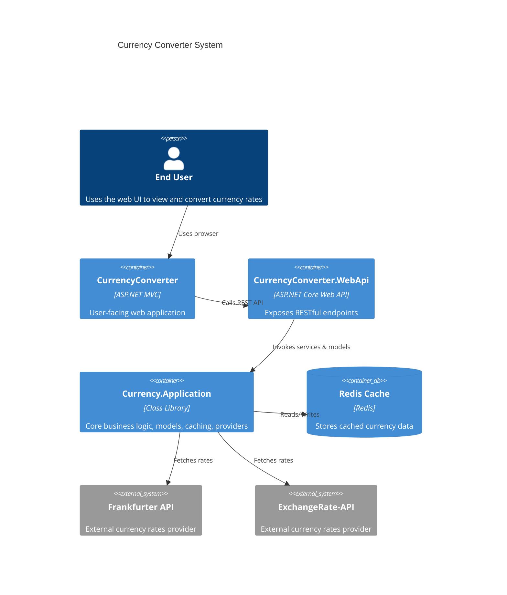

# Currency Converter

## Introduction

CurrencyConverter is an ASP.NET Core based application that provides currency conversion services and exchange rate information. The solution is divided into several projects including a web front‑end with MVC views, a WebAPI secured by IdentityServer, and an application layer that manages currency conversion logic and caching. The application integrates with multiple currency provider APIs (for example, “frankfurter” and “openexchange”) so users can obtain the latest rates, convert currencies, and even explore historical exchange data. The system is built on .NET 8 and uses industry‑standard components such as IdentityServer4 for authentication, Redis for caching, and Swagger for API documentation.

## Project Structure

## Project Structure

1. 📦 [Currency.Application](#currencyapplication)  
   1.1. 📜 [Constants](#constants)  
   1.2. 🛠️ [Helpers](#helpers)  
   1.3. 🔗 [Interfaces](#interfaces)  
   1.4. 🏷️ [Models](#models)  
   1.5. 🚀 [Services](#services)  
2. 🎨 [CurrencyConverter (MVC UI)](#currencyconverter-mvc-ui)  
3. 📡 [CurrencyConverter.WebApi](#currencyconverter-webapi)  
   3.1. 🔌 [API Endpoints](#api-endpoints)  
4. 🧪 [Tests](#tests)  

---

##  System Overview



## 📦 Currency.Application
The Currency.Application project is the core, provider-agnostic domain layer where all business rules, contracts, and cross-cutting concerns live. It supplies:

- Contracts (interfaces) to abstract provider integrations and caching.
- Models and validation rules for requests/responses.
- Provider implementations for external APIs (Frankfurter and ExchangeRate-API).
- Middleware for observability and protection (correlation, rate limiting, structured logging).
- Dependency injection registrations and Serilog/OpenTelemetry-style logging enrichment.
- IdentityServer configuration for local development/testing and claim-based behaviors (role, provider, rate limits).

At runtime, the Web API calls into this library to:
1) Validate incoming request models (e.g., currency codes and exclusions).  
2) Resolve the proper provider via `IProviderFactoryService` based on the authenticated user’s `currency_provider` claim.  
3) Use resilient HTTP calls (Polly) to fetch data and cache results in Redis.  
4) Enrich all logs with correlation/user metadata, apply request logging, and guard APIs with per-user rate limiting.


### 2.1 📜 Constants

**CurrencyConstants.cs**  
Defines globally excluded currencies and error message.  
- `ExcludedCurrencies`: e.g. `"TRY","PLN","THB","MXN"`  
- `ExcludedCurrencyErrorMessage`: explains unsupported currencies 

---

### 2.2 🛠️ Helpers

#### 2.2.1 Extensions

| File                                       | Purpose                                                                                                    |
|--------------------------------------------|------------------------------------------------------------------------------------------------------------|
| **ClaimService.cs**                        | Provides strongly-typed access to user claims (e.g. provider, rate limit, correlation ID)  |
| **HttpClientExtensions.cs**                | Defines Polly resilience policies (retry, circuit-breaker, timeout) for HTTP calls  |
| **ServiceCollectionExtensions.cs**         | Registers DI services, HTTP clients, middleware, logging, IdentityServer, Redis, Swagger  |

#### 2.2.2 Middleware

| File                                      | Responsibility                                                                                           |
|-------------------------------------------|----------------------------------------------------------------------------------------------------------|
| **CorrelationIdMiddleware.cs**            | Ensures each request/response has an `X-Correlation-ID` header for tracing                               |
| **RequestLoggingMiddleware.cs**           | Logs incoming requests with method, path, client ID, status, elapsed time            |
| **SerilogContextMiddleware.cs**           | Enriches Serilog context with CorrelationID, TraceID, SpanID, UserID, Provider          |
| **UserRateLimitMiddleware.cs**            | Enforces per-user rate limits stored in Redis; returns 429 when exceeded              |

#### 2.2.3 Observability

**ActivityTraceEnricher.cs**  
Adds `TraceId` and `SpanId` from `System.Diagnostics.Activity` to Serilog events 

#### 2.2.4 Config & JWT

| File             | Purpose                                                                       |
|------------------|-------------------------------------------------------------------------------|
| **Config.cs**    | Defines IdentityServer4 clients, scopes, resources, test users  |
| **JwtTokenHelper.cs** | Generates JWT tokens for UI/Auth flows                           |

---

### 2.3 🔗 Interfaces

| File                                 | Contract                                                                                 |
|--------------------------------------|------------------------------------------------------------------------------------------|
| **IClaimService.cs**                 | Abstracts retrieval of user claims (ID, provider, rate limit, correlation)  |
| **ICurrencyProvider.cs**             | Defines methods for latest, historical, and conversion operations       |
| **IProviderFactoryService.cs**       | Resolves the correct `ICurrencyProvider` based on user’s claim                            |
| **IRedisCacheService.cs**            | Abstracts Redis caching operations (Get, Set, Remove)                 |

---

### 2.4 🏷️ Models

#### Requests

- **ConvertExchangeRatesRequest.cs**: `{ From, To, Amount }`, validation of codes   
- **HistoricalRequest.cs**: extends `CommonFields` with date range, paging  
- **RatesRequest.cs**: extends `CommonFields` with optional `StartDate`  
- **TokenRequest.cs** / **LoginRequest.cs**: used by UI/WebApi Login flows  

#### Responses

- **ConvertExchangeRatesResponse.cs**: includes converted amounts per currency  
- **ExchangeRateResponse.cs**: maps external API payload from ExchangeRate-API  
- **HistoricalRateApiResponse.cs** & **HistoricalRateResponse.cs**: hold paged historical data  

#### Common

- **ApiResponse.cs**: generic wrapper `{ object? Data }`  
- **CommonFields.cs**: `[BaseCurrency, Symbols]` with blacklist validation   
- **RateResponse.cs** / **RateResponseDto.cs**: map Frankfurter API JSON   
- **ValidateRequest.cs**: custom attributes for currency code(s) validation   

---

### 2.5 🚀 Services

| File                                   | Role                                                                                                    |
|----------------------------------------|---------------------------------------------------------------------------------------------------------|
| **RedisCacheService.cs**               | Implements `IRedisCacheService` using `IDistributedCache`/StackExchange.Redis                           |
| **FrankFurterProviderService.cs**      | Calls Frankfurter API for rates; logs & caches results                              |
| **OpenExchangeRatesProviderService.cs**| Calls ExchangeRate-API for rates; config-driven `AppId`                            |
| **ProviderFactoryService.cs**          | Chooses provider implementation based on claim (Frankfurter vs OpenExchange)        |

---

## 🎨 CurrencyConverter (MVC UI)
The CurrencyConverter MVC UI is the user-facing front-end. It renders Razor views for Latest rates, Historical rates, and Currency Conversion, and delegates all business operations to the Web API via a named HttpClient ("CurrencyApi"). Controllers collect user input (query parameters or form posts), call the corresponding Web API endpoints (POST actions), and then render the returned DTOs in views. The UI is intentionally thin: it performs basic validation, displays errors, and leaves provider selection, caching, rate limiting, and authorization to the API/Application layers.

- **Controllers/**  
  - **HomeController.cs**: Serves home & privacy views  
  - **LoginController.cs**: Handles login via IdentityServer (redirects/forms)  
  - **RatesController.cs**:  
    - `Latest`, `GetHistoricalExchangeRates`, `Convert` actions call **Web API** via `HttpClientFactory` and render views   

- **Views/**: Razor pages for Index, Privacy, Login, Latest rates, Historical rates, Conversion  

- **Program.cs & appsettings.json**: Configures cookie auth, endpoints, `HttpClient` named `"CurrencyApi"`  

- **wwwroot/js/site.js**: UI scripting for form enhancements  

---
## 📡 CurrencyConverter.WebApi

The CurrencyConverter.WebApi project exposes the system’s REST endpoints. It enforces JWT bearer authentication and role-based authorization, orchestrates requests using `IClaimService` and `IProviderFactoryService`, and integrates the Redis cache. Each endpoint validates inputs, checks the user’s assigned `currency_provider` claim, optionally serves cached results, and otherwise invokes the appropriate provider in Currency.Application. Cross-cutting middlewares from the Application layer (correlation ID, rate limiting, request logging) can be added to the pipeline for observability and protection.
### 4.1 🔌 API Endpoints

#### 1. Get Token

```api
{
  "title": "Get Token",
  "description": "Issues a JWT from IdentityServer via ROPC flow",
  "method": "POST",
  "baseUrl": "https://localhost:5001",
  "endpoint": "/api/Login/GetToken",
  "headers": [
    { "key": "Content-Type", "value": "application/json", "required": true }
  ],
  "bodyType": "json",
  "requestBody": "{\n  \"username\": \"ff_admin\",\n  \"password\": \"password2\",\n  \"clientId\": \"frankfurter\",\n  \"clientSecret\": \"frankfurter_secret\"\n}",
  "responses": {
    "200": {
      "description": "Returns raw token response",
      "body": "\"{ \\\"access_token\\\": \\\"...\\\", ... }\""
    },
    "400": {
      "description": "Missing or invalid credentials",
      "body": "\"Username, Password, ClientId, and ClientSecret are required.\""
    }
  }
}
```

#### 2. Get Latest Rates

```api
{
  "title": "Get Latest Rates",
  "description": "Fetches latest currency rates, optionally cached",
  "method": "POST",
  "baseUrl": "https://localhost:5001",
  "endpoint": "/api/Rates/GetLatestRatesAsync",
  "headers": [
    { "key": "Authorization", "value": "Bearer <token>", "required": true },
    { "key": "Content-Type", "value": "application/json", "required": true }
  ],
  "bodyType": "json",
  "requestBody": "{\n  \"baseCurrency\": \"USD\",\n  \"symbols\": \"EUR,GBP\",\n  \"startDate\": \"2025-08-26T00:00:00Z\"\n}",
  "responses": {
    "200": {
      "description": "Returns `RateResponse`",
      "body": "{\n  \"base\": \"USD\",\n  \"date\": \"2025-08-26\",\n  \"rates\": { \"EUR\": 0.91, \"GBP\": 0.79 }\n}"
    },
    "400": {
      "description": "Provider not assigned",
      "body": "{ \"Error\": \"ProviderNotAssigned\", \"Message\": \"Currency provider not assigned to user.\", \"Timestamp\": \"...\" }"
    },
    "500": {
      "description": "Internal errors",
      "body": "{ \"Error\": \"InternalServerError\", \"Message\": \"...\", \"Timestamp\": \"...\" }"
    }
  }
}
```

#### 3. Get Historical Rates

```api
{
  "title": "Get Historical Exchange Rates",
  "description": "Retrieves historical rates with paging, optionally from cache",
  "method": "POST",
  "baseUrl": "https://localhost:5001",
  "endpoint": "/api/Rates/GetHistoricalExchangeRates",
  "headers": [
    { "key": "Authorization", "value": "Bearer <token>", "required": true },
    { "key": "Content-Type", "value": "application/json", "required": true }
  ],
  "bodyType": "json",
  "requestBody": "{\n  \"baseCurrency\": \"USD\",\n  \"symbols\": \"EUR,GBP\",\n  \"startDate\": \"2025-08-01T00:00:00Z\",\n  \"endDate\": \"2025-08-05T00:00:00Z\",\n  \"pageNumber\": 1,\n  \"pageSize\": 2\n}",
  "responses": {
    "200": {
      "description": "Returns `HistoricalRateResponse`",
      "body": "{ ... }"
    },
    "400": {
      "description": "Provider not assigned",
      "body": "{ \"Error\": \"ProviderNotAssigned\", ... }"
    },
    "500": {
      "description": "Internal errors",
      "body": "{ \"Error\": \"InternalServerError\", ... }"
    }
  }
}
```

#### 4. Convert Exchange Rates

```api
{
  "title": "Convert Exchange Rates",
  "description": "Converts an amount from one currency to target currencies",
  "method": "POST",
  "baseUrl": "https://localhost:5001",
  "endpoint": "/api/Rates/ConvertExchangeRates",
  "headers": [
    { "key": "Authorization", "value": "Bearer <token>", "required": true },
    { "key": "Content-Type", "value": "application/json", "required": true }
  ],
  "bodyType": "json",
  "requestBody": "{\n  \"from\": \"USD\",\n  \"to\": \"EUR,GBP\",\n  \"amount\": 100.0\n}",
  "responses": {
    "200": {
      "description": "Conversion result",
      "body": "{\n  \"from\": \"USD\",\n  \"to\": \"EUR,GBP\",\n  \"amount\": 100.0,\n  \"date\": \"2025-08-26\",\n  \"convertedAmounts\": { \"EUR\": 91.0, \"GBP\": 79.0 }\n}"
    },
    "400": {
      "description": "Validation error or unsupported currency",
      "body": "{ \"Error\": \"UnsupportedCurrency\", \"Message\": \"...” }"
    },
    "500": {
      "description": "Internal errors",
      "body": "{ \"Error\": \"InternalServerError\", \"Message\": \"...\", \"Timestamp\": \"...\" }"
    }
  }
}
```

---

## 🧪 Tests

- **Currency.UnitTests.cs**: Unit tests for `RatesController` and provider services using Moq and xUnit  
- **Currency.IntegrationTests.cs**: Integration-style tests for caching and multi-step flows  
- Both projects reference `Currency.Application` and `CurrencyConverter.WebApi` 

---
## Features

- **Currency Conversion:** Submit an amount and convert from one currency to another using supported providers. The conversion logic validates the input and rejects unsupported currencies such as TRY, PLN, THB, and MXN. fileciteturn0file16
- **Latest Rates:** Retrieve and display the most recent currency rates along with the associated date.
- **Historical Rates:** Query historical exchange rates over a specified date range.
- **Multiple Providers:** Supports at least two currency providers – one focused on the frankfurter API and another on openexchange.
- **Authentication & Authorization:** Secured API endpoints with IdentityServer4, JWT Bearer tokens, and cookie authentication for the web interface.
- **Swagger Integration:** Auto-generated Swagger user interface is available during development for testing endpoints.
- **Caching:** Redis integration to improve performance for recurring requests.
- **Responsive UI:** Modern web views built using Razor and Bootstrap ensure a user-friendly experience on different devices.

## Requirements

- **.NET 8 SDK:** Ensure that the latest .NET 8 SDK is installed to build and run the application.
- **Redis Server:** A running Redis instance is required for caching responses.
- **Identity Server Configuration:** The API security relies on IdentityServer4. You must provide valid client credentials and configure the token authority.
- **NuGet Dependencies:**  
  - IdentityServer4 and IdentityServer4.Storage  
  - Microsoft.AspNetCore.Authentication.JwtBearer  
  - Swashbuckle.AspNetCore  
  - Various OpenTelemetry, Polly, and Serilog packages  
  (See the respective project files for full details.) fileciteturn0file17

## Installation

1. **Clone the Repository:**

   Code example:
   ------------------------------------------------
   git clone 
   ------------------------------------------------

2. **Restore NuGet Packages:**

   Open a terminal at the solution root and run:
   ------------------------------------------------
   dotnet restore
   ------------------------------------------------

3. **Update Configuration Files:**

   - In *appsettings.json* (located under the WebAPI project), update the settings for IdentityServerConfig, RedisServerConfig, OpenExchangeRates (such as the AppId), and Token authority. 
   - In *Currency.Application/Constants/CurrencyConstants.cs*, note the excluded currencies that the application currently does not support.

4. **Build the Solution:**

   Run:
   ------------------------------------------------
   dotnet build
   ------------------------------------------------

## Usage

### Running the Application

- **Web API:**
  - Navigate to the WebAPI project (CurrencyConverter.WebApi) directory.
  - Run the project using:
    ------------------------------------------------
    dotnet run
    ------------------------------------------------
  - The Swagger UI is automatically launched when the environment is development (check *launchSettings.json* for the URL). 

- **Web Front‑end:**
  - The MVC project (CurrencyConverter) provides user interfaces for rates and currency conversion.
  - Open a browser and navigate to the default URL (e.g., https://localhost) to access the conversion view and historical rate pages.

### API Endpoints

- **Currency Rate Retrieval:** Endpoints such as `/Rates/GetLatestRatesAsync` and `/Rates/GetHistoricalExchangeRates` are available from the API secured by token authentication.
- **Currency Conversion:** The `/Rates/ConvertExchangeRates` endpoint accepts POST requests with conversion details.
- **Authentication:** Use the `/api/Login/GetToken` endpoint to generate an access token by posting a valid TokenRequest object. 

### UI Features

- **Latest Rates Page:** View the current conversion rates and the last updated date.
- **Currency Conversion Form:** Fill in the source currency, target currency, and amount. Validation ensures invalid inputs are rejected.
- **Historical Rates Page:** Enter a base currency and date range to retrieve the historical data in a tabular format.

## Configuration

The application is highly configurable. The key settings are available via the following files:

| File | Configuration Setting | Description |
|------|-----------------------|-------------|
| appsettings.json (WebAPI) | IdentityServerConfig and Token | Settings for client authentication, client secrets, and authority URLs |
| appsettings.json (WebAPI) | RedisServerConfig | Specify the Redis server address used for caching data |
| appsettings.json (WebAPI) | OpenExchangeRates | Provide the AppId required when using the OpenExchange currency provider |
| Currency.Application/Constants/CurrencyConstants.cs | ExcludedCurrencies | Contains a set of currencies for which conversion is not supported |

For example, in *appsettings.json*:
------------------------------------------------
{
  "IdentityServerConfig": {
    "ClientId": "my_client",
    "ClientSecret": "",
    "Scope": "currency_api",
    "Authority": "https://localhost:7248"
  },
  "RedisServerConfig": {
    "Authority": "localhost:6379"
  },
  "OpenExchangeRates": {
    "AppId": ""
  },
  "Token": {
    "Authority": "https://localhost:7248"
  }
}
------------------------------------------------

## Contributing

Contributions to CurrencyConverter are welcome. Here are the suggested steps for contributing:

- **Fork the Repository:** Create your own fork on GitHub.
- **Create a Branch:** Develop your feature or fix in a separate branch.
- **Commit Changes:** Ensure that your commits are concise and related to your work.
- **Testing:** The repository includes unit tests (see the CurrencyConverterTests project) to help verify that your changes do not break existing functionalities.
- **Pull Request:** Submit a pull request with a clear description of your updates.

Before submitting a pull request, please review the coding standards and project structure. Discussions on issues and enhancement requests are welcomed.

------------------------------------------------------------

With its robust architecture and integrated features, CurrencyConverter provides a seamless experience whether you prefer using its web interface or calling its secured APIs. Enjoy contributing and using the application!xchange data. The system is built on .NET 8 and uses industry‑standard components such as IdentityServer4 for authentication, Redis for caching, and Swagger for API documentation
